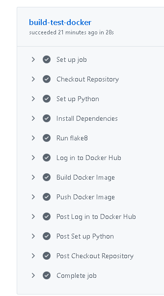
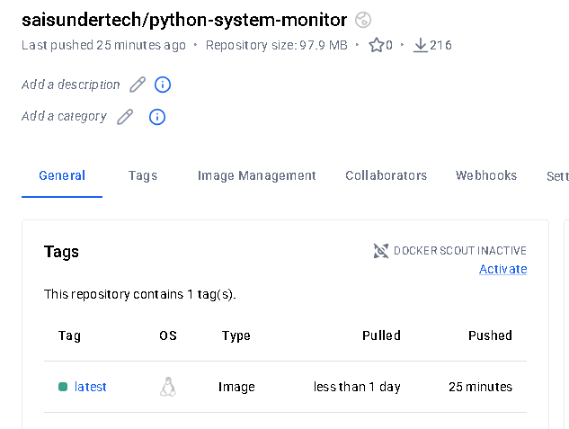
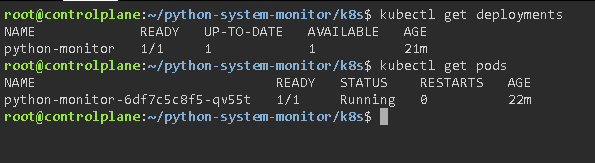
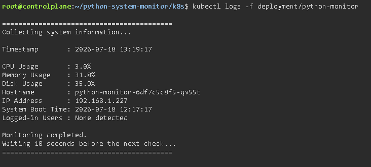

# 🖥️ Python System Monitor

A modular Python-based system monitoring application that displays real-time system information including CPU, memory, disk usage, hostname, IP address, system boot time, and logged-in users. The project is containerized using Docker and includes automated CI with GitHub Actions.

---

## 📌 Features

- 📊 Monitor CPU usage
- 💾 Monitor Memory usage
- 💽 Monitor Disk usage
- 🖥️ Display Hostname
- 🌐 Display IP Address
- ⏱️ Display System Boot Time (Uptime)
- 👥 Display Logged-in Users
- ⚠️ Configurable CPU usage threshold warning
- ⚙️ Configurable monitoring interval using `.env`
- 📝 Logging to `system.log`
- 🛑 Graceful shutdown using `Ctrl + C`
- 🛡️ Exception handling for improved reliability
- 🐳 Docker container support
- 🔄 GitHub Actions CI pipeline

---

## 🛠️ Technologies Used

- Python 3
- Linux (Ubuntu / WSL)
- Docker
- Git
- GitHub
- GitHub Actions
- python-dotenv
- psutil

---

## 📂 Project Structure

```text
python-system-monitor/
│
├── monitor.py
├── cpu.py
├── memory.py
├── disk.py
├── system_info.py
├── uptime.py
├── users.py
├── logger.py
├── requirements.txt
├── Dockerfile
├── .env
├── .gitignore
├── README.md
├── system.log
│
├── .github/
│   └── workflows/
│       └── python-ci.yml
│
└── k8s/
    ├── deployment.yaml
    └── service.yaml
```
> **Note:** Kubernetes deployment manifests are included in this repository. The application has been successfully deployed and validated on a Kubernetes cluster using Killercoda.

---

# 📸 Project Demonstration

## GitHub Actions

The CI pipeline automatically installs dependencies, validates the code, builds the Docker image, and pushes it to Docker Hub.



---

## Docker Hub

The latest Docker image is published to Docker Hub and is used for containerized deployments.



---

## Kubernetes Deployment

The application is deployed as a Kubernetes Deployment and the Pod is successfully running.



---

## Application Logs

The application runs successfully inside a Kubernetes Pod and continuously monitors the system every configured interval.



---
---

## ⚙️ Installation

Clone the repository:

```bash
git clone https://github.com/saisunder-tech/python-system-monitor.git
```

Navigate into the project:

```bash
cd python-system-monitor
```

Create a virtual environment:

```bash
python3 -m venv .venv
```

Activate it:

Linux / WSL

```bash
source .venv/bin/activate
```

Install dependencies:

```bash
pip install -r requirements.txt
```

---

## ⚙️ Configuration

Create a `.env` file in the project root.

Example:

```env
CPU_THRESHOLD=80
MONITOR_INTERVAL=10
LOG_LEVEL=INFO
LOG_FILE=system.log
```

---

## ▶️ Run the Application

```bash
python monitor.py
```

---

## 🐳 Run Using Docker

Build the Docker image:

```bash
docker build -t python-system-monitor .
```

Run the container:

```bash
docker run --rm python-system-monitor
```

---

## 🔄 GitHub Actions

A GitHub Actions workflow automatically:

- Installs dependencies
- Performs Python syntax validation
- Executes CI checks on every push and pull request

Workflow location:

```text
.github/workflows/python-ci.yml
```

---

## 📄 Logging

Application logs are written to:

```text
system.log
```

The log file records:

- CPU Usage
- Memory Usage
- Disk Usage
- Hostname
- IP Address
- Boot Time
- Logged-in Users
- Warning messages
- Unexpected exceptions
- Application shutdown events

---

## 🚀 Future Improvements

- Email alerts for high CPU usage
- Slack / Microsoft Teams notifications
- Web dashboard using Flask
- REST API for monitoring data
- Kubernetes deployment validation
- Prometheus metrics integration
- Grafana dashboard integration

---

## 👨‍💻 Author

**Sai Sunder**

GitHub:

https://github.com/saisunder-tech

---

## 📜 License

This project is licensed under the MIT License.
