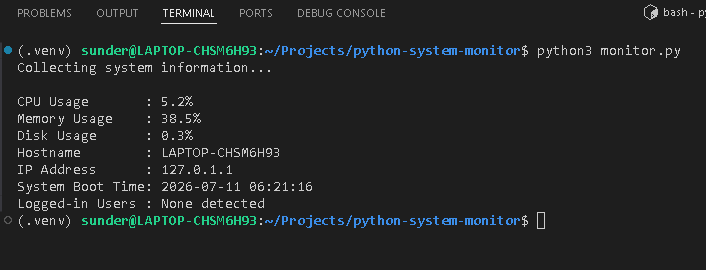
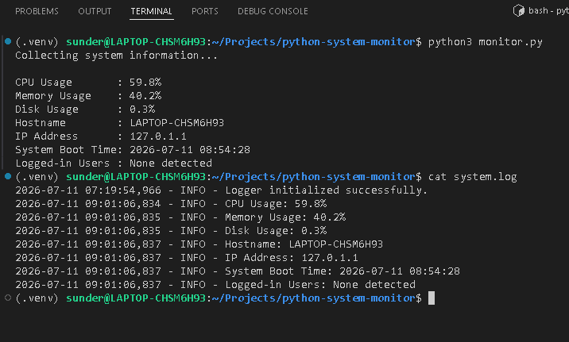

# Python System Monitor

A beginner-friendly Linux system monitoring utility written in Python. It displays key system metrics such as CPU, memory, and disk usage, along with system information including hostname, IP address, boot time, and logged-in users. The application also generates warnings for high CPU usage and records monitoring information in a log file.

## Features

- CPU usage monitoring with high-usage warnings
- RAM usage monitoring
- Disk usage monitoring
- Hostname and IP address display
- System uptime (boot time) display
- Logged-in user detection
- Logging of monitoring information to `system.log`

## Project Structure

```text
python-system-monitor/
├── cpu.py
├── memory.py
├── disk.py
├── system_info.py
├── uptime.py
├── users.py
├── logger.py
├── monitor.py
├── requirements.txt
├── .gitignore
├── README.md
└── docs/
    └── images/
```

## Prerequisites

- Python 3.10 or later
- Linux or WSL
- `psutil` Python package

## Installation

```bash
git clone <your-repository-url>
cd python-system-monitor
python3 -m venv .venv
source .venv/bin/activate
pip install -r requirements.txt
```

## Usage

```bash
python3 monitor.py
```

## Sample Output




## Logging

The application writes monitoring information and warnings to `system.log`. Log files and Python cache files are excluded from version control via `.gitignore`.

## Future Enhancements

- Docker containerization
- Azure DevOps CI/CD pipeline
- Kubernetes deployment
- Azure VM deployment

## License

MIT License

